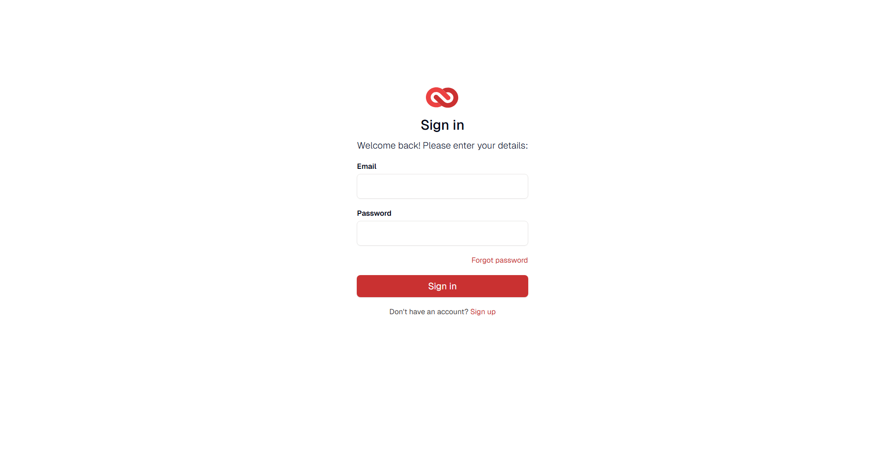
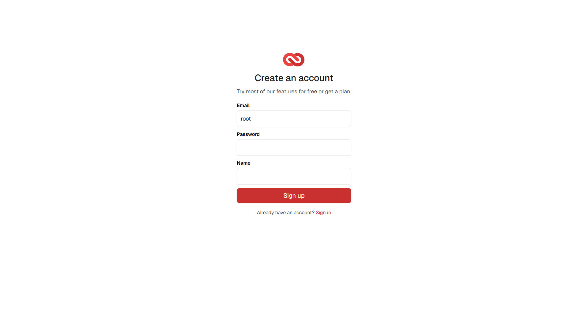
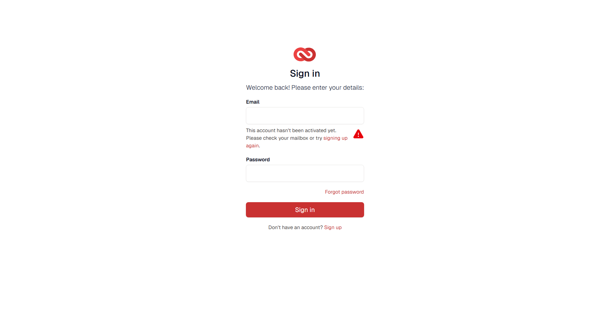

# Login

[01]

[01-1]

[02]

[03]

[04]

[04-1]

[05]

Description and behaviors:

- [01] Login screen containing
  - Logo
  - Title
  - Fields (Email, password)
  - Sign-in button.
  - 'Forgot password' link
  - Link redirecting the user to the registration screen [01-1].
- [02] When clicking the button without entering anything, a message appears below the email field.
- [03] When entering the email and clicking the button without entering the password, a message appears below the password field.
- [04] Password recovery page.
- [04-1] When trying to recover a password with an email address that doesn't exist, a message appears stating that the email address was not found.
- [05] When registering, the user is redirected to a message screen. However, the user is not registered in the 'LOCAL' database.

# Dashboard

[01]

