# Login / Register Screen

[01]

[01-1]

[02]

[03]
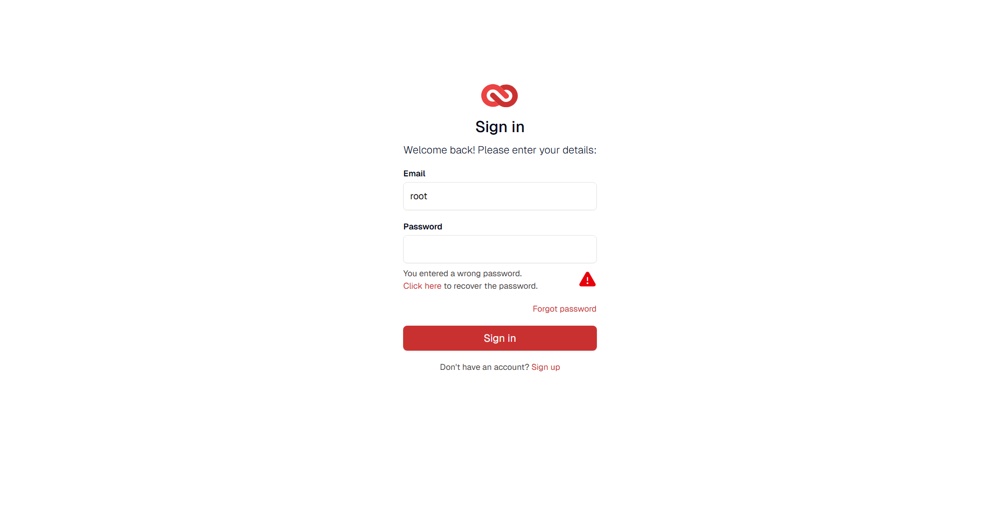
[04]
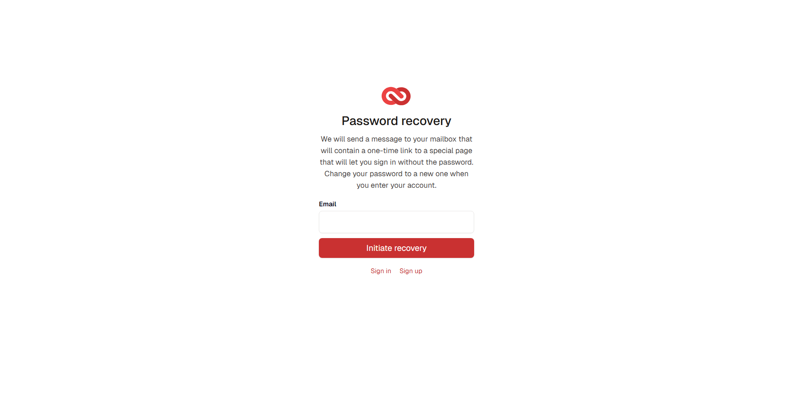
[04-1]
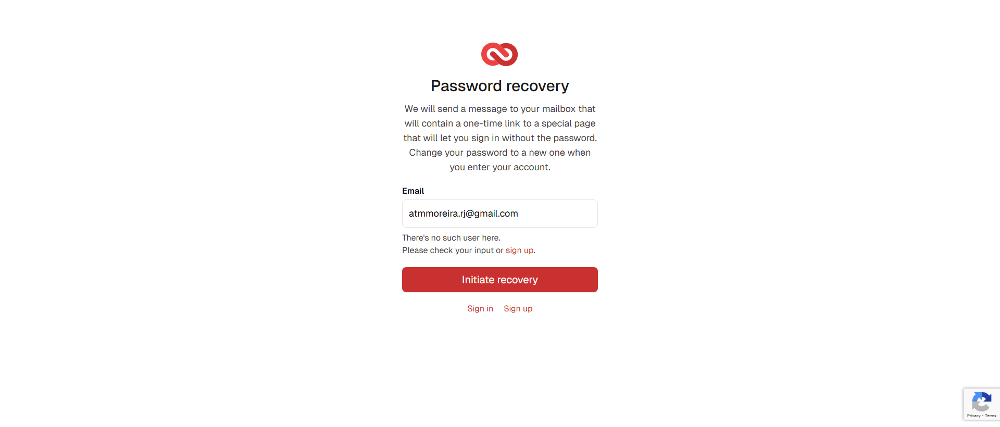
[05]
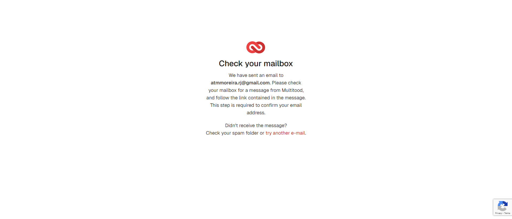

Description and behaviors:

- [01] Login screen containing
  - Logo
  - Title
  - Fields (Email, password)
  - Sign-in button.
  - 'Forgot password' link
  - Link redirecting the user to the registration screen [01-1].
- [02] When clicking the button without entering anything, a message appears below the email field.
- [03] When entering the email and clicking the button without entering the password, a message appears below the password field.
- [04] Password recovery page.
- [04-1] When trying to recover a password with an email address that doesn't exist, a message appears stating that the email address was not found.
- [05] When registering, the user is redirected to a message screen. However, the user is not registered in the 'LOCAL' database.

# Dashboard Screen

[01]
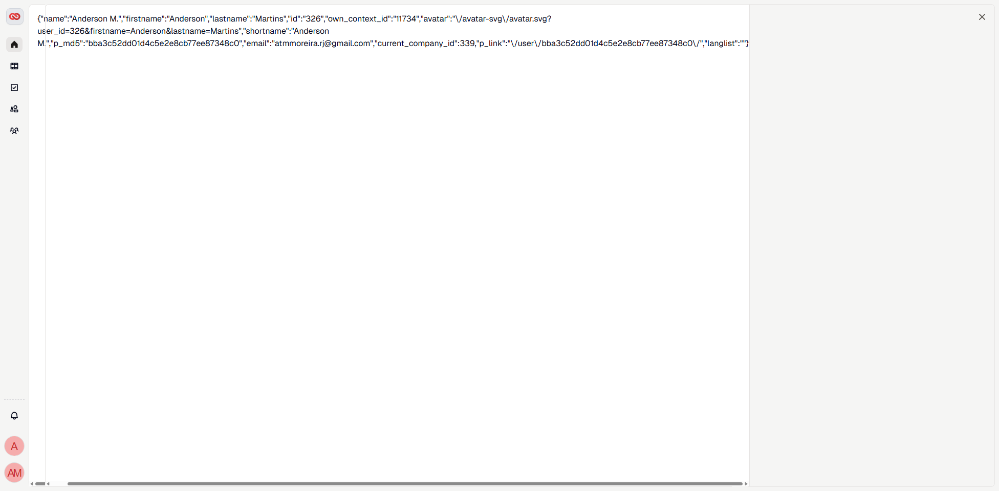

Description and behaviors:

- [01] Just a JSON.

# Project Screen

[01]
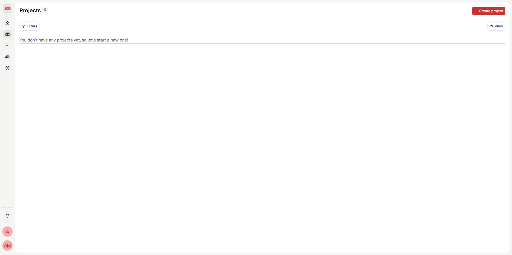
[02]
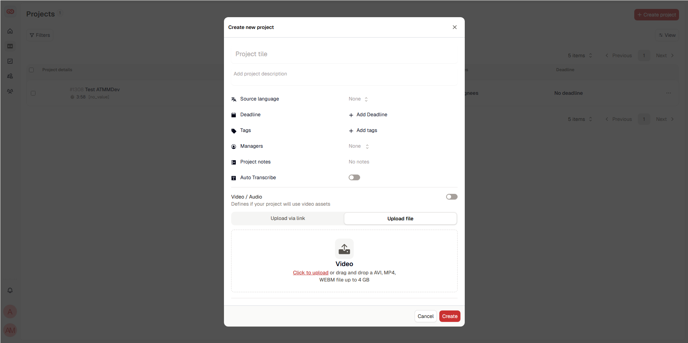
[02.1]
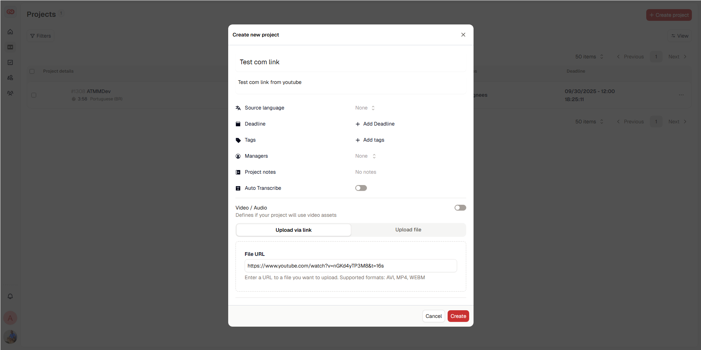
[02.2]
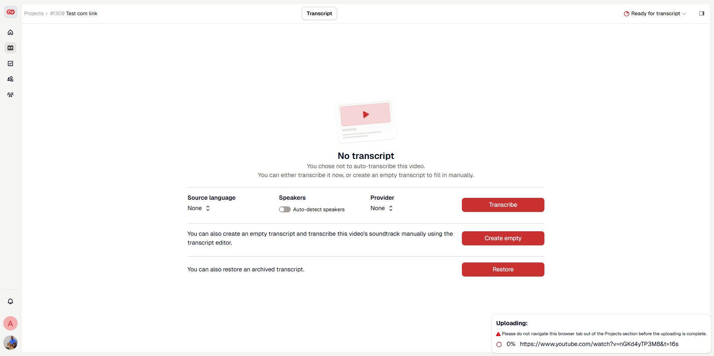
[03]
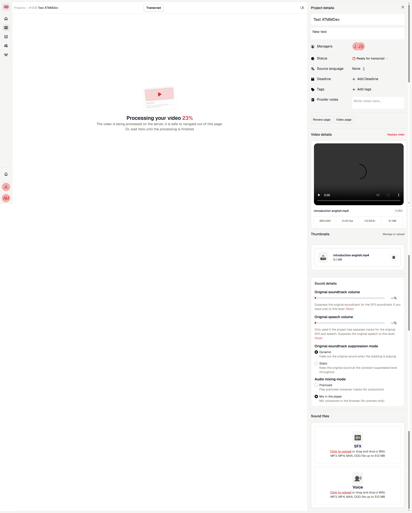
[04]
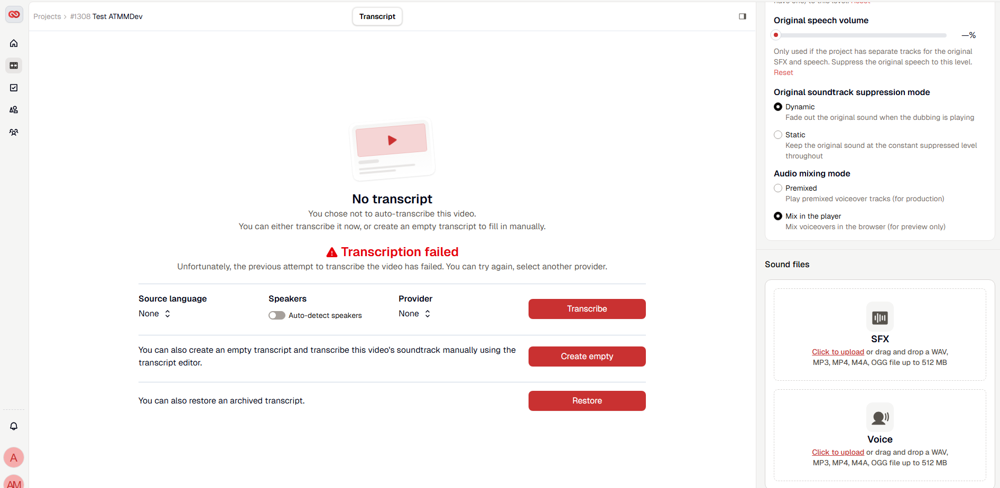
[05]
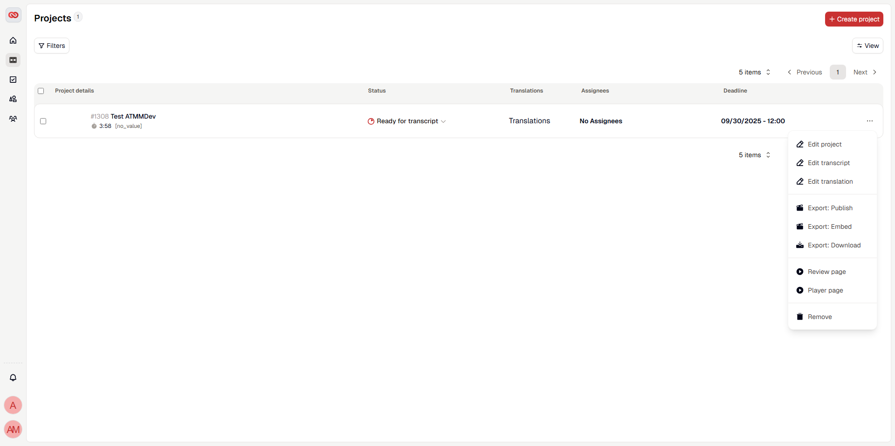
[06]

Description and behaviors:

- [01] Start with a white screen.
- [02] When we click in the button Create Project, open a modal with a form to fill.
- [02.1] Form with fields to fill.
- [02.2] Uploading do not working.
- [03] When we upload a movie, the system process our video.
  - Clicking in the play, the video run correctly.
  - Adding tags is ok.
- [04] When I click to transcript, the app `Transcription failed`.
- Filters and Vies buttons doesnt work.

When the video is loaded:

- [05] The options - Edit, Translation and Exports is not working. Review and Player Page, goes from another page with different video.
- [06] The transcription is not working.

# Task Screen

[01]
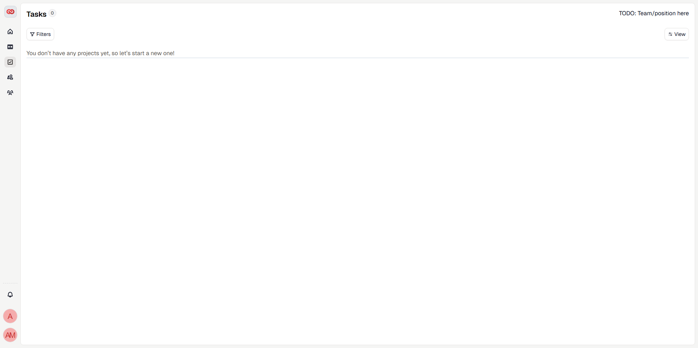

Description and behaviors:

- [01] Start with a white screen.

# Tailwind CSS Screen

[01]
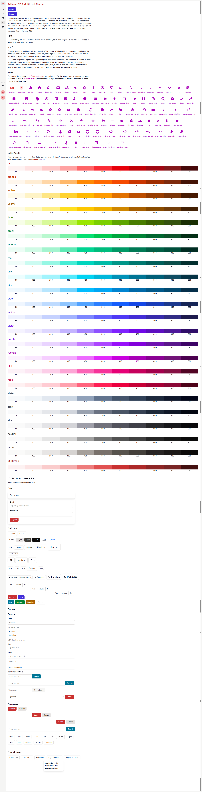

Description and behaviors:

- [01] Page with some components.

# Profile Screen

[01]

[02]
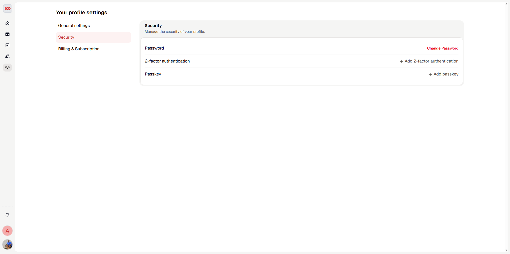
[03]
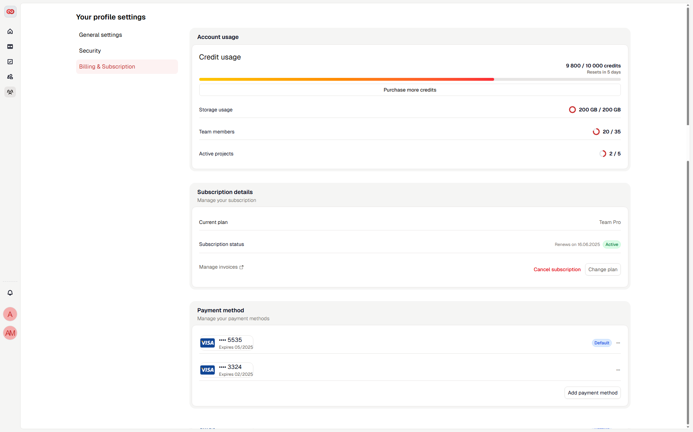
[04]
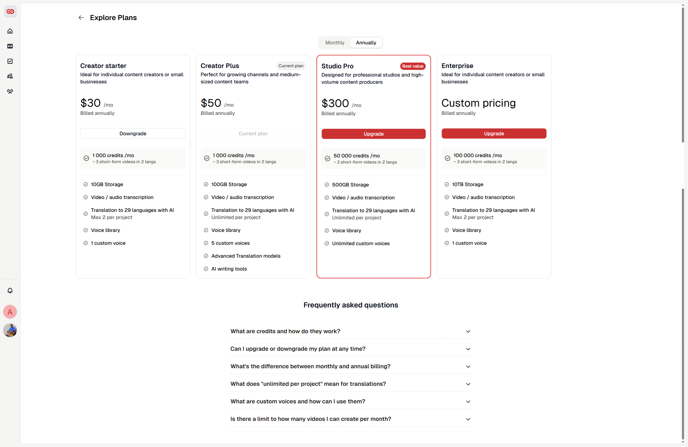

Description and behaviors:

- [01] Page with form.
- [02] Page secutiry informations. Add teo factor and add passkey, is not working.
- [03] Page with Billing form. Button `Purchase more credits`, is not working.
  - Buttons `Manage Invoices`, `Cancel Subscripion` and `add payment methods` doesn't work.
- [04] Page with static content, and buttons doesn't working.

# Teams and Rules Screen

[01]
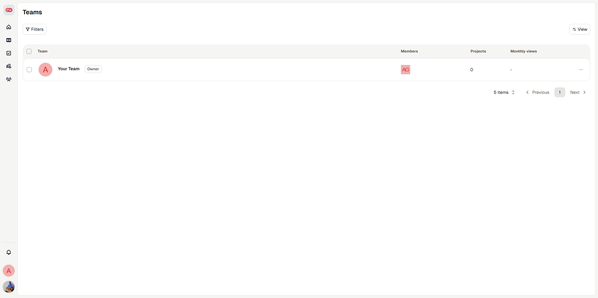
[02]
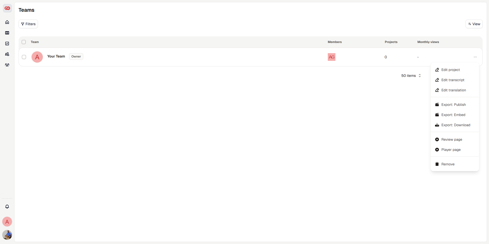

Description and behaviors:

- [01] Page with a list of users.
- [02] The options - Edit, Translation and Exports is not working. Review and Player Page, goes from another page with different video.
- [02] The transcription is not working.
